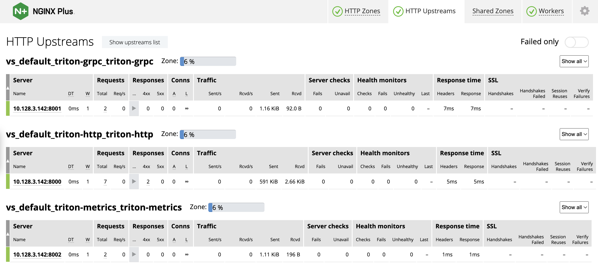

# NGINX+ Ingress Controller for Triton Inference Server on ROSA


This repository showcases a practical implementation of the NGINX Plus Ingress Controller managing and securing the NVIDIA Triton Inference Server deployed on Red Hat OpenShift Service on AWS (ROSA). The example demonstrates how to effectively control and safeguard the server environment using NGINX Plus capabilities within the ROSA ecosystem.

## Prerequisites

Before proceeding, ensure that you have:
- A functional Red Hat OpenShift on AWS (ROSA) cluster.
- Helm installed (refer to the [Helm installation guide](https://helm.sh/docs/intro/install/)).
- Prometheus and Grafana installed to collect and display metrics from the Triton Inference Server (instructions provided below).
- If using GPUs for inference, ensure your cluster includes GPU nodes with appropriate NVIDIA drivers and CUDA support.

## Setup Overview

1. **Prepare a Model Repository**: Setup a repository where the Triton Server will fetch its models.
2. **Install Prometheus and Grafana**: These services are required for monitoring.
3. **Deploy the Triton Inference Server**: Using Helm, deploy the server into your Kubernetes environment.
4. **Access Metrics and Perform Inference**: Monitor the server and send inference requests.

## Detailed Instructions

### Install Helm

#### Helm v3
For a new installation:
- Follow the steps from the [official helm install guide](https://helm.sh/docs/intro/install/).

To migrate from Helm v2 to v3:
- Refer to the [official migration guide](https://helm.sh/docs/topics/v2_v3_migration/).

#### Helm v2 Installation (Deprecated)
```bash
curl https://raw.githubusercontent.com/helm/helm/master/scripts/get | bash
kubectl create serviceaccount -n kube-system tiller
kubectl create clusterrolebinding tiller-cluster-rule --clusterrole=cluster-admin --serviceaccount=kube-system:tiller
helm init --service-account tiller --wait
```

## Create a Model Repository

If you already have a model repository you may use that with this helm
chart. If you do not have a model repository, you can checkout a local
copy of the inference server source repository to create an example
model repository::

```
$ git clone https://github.com/triton-inference-server/server.git
```

Triton Server needs a repository of models that it will make available
for inferencing. For this example you will place the model repository
in an AWS S3 Storage bucket.

```
$ aws s3 mb s3://triton-inference-server-repository
```

Following the [QuickStart](../../docs/getting_started/quickstart.md) download the
example model repository to your system and copy it into the AWS S3
bucket.

```
$ aws s3 cp --recursive docs/examples/model_repository s3://triton-inference-server-repository/model_repository
```

### AWS Model Repository Setup
To load the model from the AWS S3, you need to convert the following AWS credentials in the base64 format and add it to the values.yaml

```
echo -n 'REGION' | base64
echo -n 'SECRECT_KEY_ID' | base64
echo -n 'SECRET_ACCESS_KEY' | base64
```

## Deploy Prometheus and Grafana

The inference server metrics are collected by Prometheus and viewable
by Grafana. The inference server helm chart assumes that Prometheus
and Grafana are available so this step must be followed even if you
don't want to use Grafana.

Use the [kube-prometheus-stack](https://github.com/prometheus-community/helm-charts/tree/main/charts/kube-prometheus-stack) to install these components. The
*serviceMonitorSelectorNilUsesHelmValues* flag is needed so that
Prometheus can find the inference server metrics in the *example*
release deployed below.

```
$ helm install example-metrics --set prometheus.prometheusSpec.serviceMonitorSelectorNilUsesHelmValues=false prometheus-community/kube-prometheus-stack
```

Then port-forward to the Grafana service so you can access it from
your local browser.

```
$ kubectl port-forward service/example-metrics-grafana 8080:80
```

Now you should be able to navigate in your browser to localhost:8080
and see the Grafana login page. Use username=admin and
password=prom-operator to login.

An example Grafana dashboard is available in dashboard.json. Use the
import function in Grafana to import and view this dashboard.

## Deploy the Inference Server

To deploy the Triton Inference Server using the default configurations, follow these steps:

### Configuration
First, set up the *values.yaml* file with the necessary parameters:

```
image:
  imageName: nvcr.io/nvidia/tritonserver:24.03-py3
  pullPolicy: IfNotPresent
  # modelRepositoryServer: < Replace with the IP Address of your file server >
  modelRepositoryPath: s3://ericji-triton-inference-server-repository/model_repository
  numGpus: 0

secret:
  region: 
  id: 
  key: 
```

### Deployment Commands
Navigate to the directory containing Chart.yaml, then build and install the helm chart:

```
$ cd <directory containing Chart.yaml>
$ helm dependency build
$ helm install example .
```

### Monitoring Pod Status

Use kubectl to see status and wait until the inference server pods are
running.

```
❯ kubectl get pods
NAME                                               READY   STATUS             RESTARTS           AGE
example-triton-inference-server-594fbc4489-9g226   1/1     Running            0                  6d15h
```

### Customizing Configuration

To customize the deployment, you can directly modify the values.yaml file or use the --set option with the CLI to override specific parameters. For example, to deploy a cluster with four inference servers:

```
$ helm install example --set replicaCount=4 .
```

You can also write your own "config.yaml" file with the values you
want to override and pass it to helm.

```
$ cat << EOF > config.yaml
namespace: MyCustomNamespace
image:
  imageName: nvcr.io/nvidia/tritonserver:custom-tag
  modelRepositoryPath: gs://my_model_repository
EOF
$ helm install example -f config.yaml .
```

### Viewing Server Logs

After you start Triton you will see output on the logs showing the server starting up and loading the model. When you see output like the following, Triton is ready to accept inference requests.
```
❯ oc logs example-triton-inference-server-594fbc4489-9g226 triton-inference-server
=============================
== Triton Inference Server ==
=============================
...
I0412 06:10:45.228787 1 server.cc:677]
+----------------------+---------+--------+
| Model                | Version | Status |
+----------------------+---------+--------+
| simple               | 1       | READY  |
| simple_dyna_sequence | 1       | READY  |
| simple_identity      | 1       | READY  |
| simple_int8          | 1       | READY  |
| simple_sequence      | 1       | READY  |
| simple_string        | 1       | READY  |
+----------------------+---------+--------+

I0412 06:10:45.228945 1 metrics.cc:770] Collecting CPU metrics
I0412 06:10:45.229060 1 tritonserver.cc:2538]
...
...
I0412 06:10:45.230810 1 grpc_server.cc:2466] Started GRPCInferenceService at 0.0.0.0:8001
I0412 06:10:45.231094 1 http_server.cc:4636] Started HTTPService at 0.0.0.0:8000
I0412 06:10:45.272846 1 http_server.cc:320] Started Metrics Service at 0.0.0.0:8002
```
## Deploy NGINX Plus Ingress Controller
OpenShift Operator to install NGINX Ingress Controller.
```
❯ oc get service -n nginx-ingress
NAME                                                        TYPE           CLUSTER-IP       EXTERNAL-IP                                                              PORT(S)                      AGE
dashboard-nginx-ingress                                     LoadBalancer   172.30.91.86     aae14a60db4b84cdfa76cbb7fa5dbf24-861668526.us-west-2.elb.amazonaws.com   80:31137/TCP                 4d16h
nginx-ingress-operator-controller-manager-metrics-service   ClusterIP      172.30.7.114     <none>                                                                   8443/TCP                     5d23h
nginxingress-sample-nginx-ingress-controller                LoadBalancer   172.30.226.115   a2bc4dfecf77b4b4eb75c5ed084716c1-364761670.us-west-2.elb.amazonaws.com   80:31080/TCP,443:32116/TCP   5d23h
```


## Using Triton Inference Server

Now that the inference server is running you can send HTTP or GRPC
requests to it to perform inferencing. By default, the inferencing
service is exposed with a LoadBalancer service type. Use the following
to find the external IP for the inference server. In this case it is
AWS ELB of *aae14a60db4b84cdfa76cbb7fa5dbf24-861668526.us-west-2.elb.amazonaws.com*.

```
$ kubectl get svc
NAME                                     TYPE           CLUSTER-IP     EXTERNAL-IP    PORT(S)                      AGE
kubernetes                               ClusterIP      10.0.0.1       <none>         443/TCP                      10d
mytest-nginx-ingress-controller          LoadBalancer   10.0.179.216   20.252.89.78   80:31336/TCP,443:31862/TCP   39m
mytest-triton-inference-server           ClusterIP      10.0.231.100   <none>         8000/TCP,8001/TCP,8002/TCP   39m
mytest-triton-inference-server-metrics   ClusterIP      10.0.21.98     <none>         8080/TCP                     39m
nfs-service                              ClusterIP      10.0.194.248   <none>         2049/TCP,20048/TCP,111/TCP   123m...
❯ oc get pods -n nginx-ingress
NAME                                                            READY   STATUS    RESTARTS   AGE
nginx-ingress-operator-controller-manager-db55c768c-bxwpg       2/2     Running   0          5d23h
nginxingress-sample-nginx-ingress-controller-57779c599c-mgfdc   1/1     Running   0          4d16h

❯ oc get service -n nginx-ingress
NAME                                                        TYPE           CLUSTER-IP       EXTERNAL-IP                                                              PORT(S)                      AGE
dashboard-nginx-ingress                                     LoadBalancer   172.30.91.86     aae14a60db4b84cdfa76cbb7fa5dbf24-861668526.us-west-2.elb.amazonaws.com   80:31137/TCP                 7d19h
nginx-ingress-operator-controller-manager-metrics-service   ClusterIP      172.30.7.114     <none>                                                                   8443/TCP                     9d
nginxingress-sample-nginx-ingress-controller                LoadBalancer   172.30.226.115   a2bc4dfecf77b4b4eb75c5ed084716c1-364761670.us-west-2.elb.amazonaws.com   80:31080/TCP,443:32116/TCP   9d

❯ oc get virtualserver
NAME             STATE   HOST                        IP    PORTS      AGE
triton-grpc      Valid   triton-grpc.f5demo.net            [80,443]   5h8m
triton-http      Valid   triton-http.f5demo.net            [80,443]   5h11m
triton-metrics   Valid   triton-metrics.f5demo.net         [80,443]   5h8m
```

The inference server exposes an HTTP endpoint on port 8000, and GRPC
endpoint on port 8001 and a Prometheus metrics endpoint on
port 8002. You can use curl to get the meta-data of the inference server
from the HTTP endpoint.

```
❯ curl triton-http.f5demo.net/v2 |jq
  % Total    % Received % Xferd  Average Speed   Time    Time     Time  Current
                                 Dload  Upload   Total   Spent    Left  Speed
100   285  100   285    0     0   2187      0 --:--:-- --:--:-- --:--:--  2175
{
  "name": "triton",
  "version": "2.44.0",
  "extensions": [
    "classification",
    "sequence",
    "model_repository",
    "model_repository(unload_dependents)",
    "schedule_policy",
    "model_configuration",
    "system_shared_memory",
    "cuda_shared_memory",
    "binary_tensor_data",
    "parameters",
    "statistics",
    "trace",
    "logging"
  ]
}
```

## Send an Inference Request

Use docker pull to get the client libraries and examples image
from NGC.

```
$ docker pull nvcr.io/nvidia/tritonserver:<xx.yy>-py3-sdk
```

Where \<xx.yy\> is the version that you want to pull. Run the client
image.

```
$ docker run -it --rm --net=host nvcr.io/nvidia/tritonserver:<xx.yy>-py3-sdk
```

From within the nvcr.io/nvidia/tritonserver:<xx.yy>-py3-sdk
image, run the example image-client application to perform image
classification using the example densenet_onnx model.

To send a request for the densenet_onnx model use an image from the
/workspace/images directory. In this case we ask for the top 3
classifications.

```
root@docker-desktop:/workspace# /workspace/install/bin/image_client -u triton-http.f5demo.net  -m densenet_onnx -c 3 -s INCEPTION /workspace/images/mug.jpg
Request 0, batch size 1
Image '/workspace/images/mug.jpg':
    15.349564 (504) = COFFEE MUG
    13.227464 (968) = CUP
    10.424892 (505) = COFFEEPOT
```

Enable port forwarding from the the Grafana service so you can access it from
your local browser.

```
kubectl port-forward pod/grafana-a-deployment-7b8f46f98c-ftztg 3000:3000
```
Now you should be able to navigate in your browser to 127.0.0.1:3000
and see the Grafana login page. Use username=root and
password=start to log in.

An example Grafana dashboard is available -*dashboard.json*- in the repo. Use the
import function in Grafana to import and view this dashboard, (see below).


The NGINX+ dashboard to view service access metrics:



## Cleanup

Once you've finished using the inference server you should use helm to
delete the deployment.

```
$ helm list
NAME            REVISION  UPDATED                   STATUS    CHART                          APP VERSION   NAMESPACE
example         1         Wed Feb 27 22:16:55 2019  DEPLOYED  triton-inference-server-1.0.0  1.0           default
example-metrics	1       	Tue Jan 21 12:24:07 2020	DEPLOYED	prometheus-operator-6.18.0   	 0.32.0     	 default

$ helm uninstall example
$ helm uninstall example-metrics
```

For the Prometheus and Grafana services, you should [explicitly delete
CRDs](https://github.com/prometheus-community/helm-charts/tree/main/charts/kube-prometheus-stack#uninstall-helm-chart):

```
$ kubectl delete crd alertmanagerconfigs.monitoring.coreos.com alertmanagers.monitoring.coreos.com podmonitors.monitoring.coreos.com probes.monitoring.coreos.com prometheuses.monitoring.coreos.com prometheusrules.monitoring.coreos.com servicemonitors.monitoring.coreos.com thanosrulers.monitoring.coreos.com
```

You may also want to delete the AWS bucket you created to hold the
model repository.

```
$ aws s3 rm -r gs://triton-inference-server-repository
```
